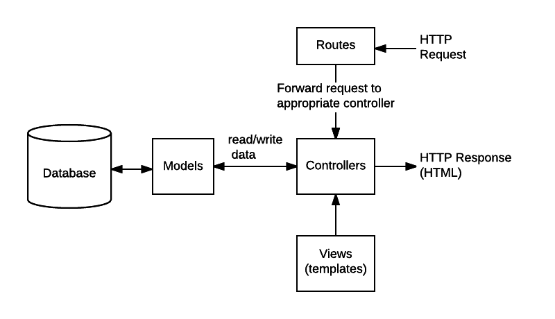

# Nodejs API Example
A basic nodejs API endpoint with mongoDB

# Contents

- [Installed modules](#installed-modules)
- [Basic commands to control development and production modes](#basic-commands-to-control-development-and-production-modes)
- [Define controllers and routes](#define-controllers-and-routes)
- [Define Bootcamp model and config mongoDB connection](#define-Bootcamp-model-and-config-mongoDB-connection)
- [The main flow of data](#the-mai-flow-of-data)
- [Conceptual design of flow](#conceptual-design-of-flow)
- [Handle errors](#handle-errors)
    + [Unhandled promise rejection](#unhandled-promise-rejection)
    + [Default express error handler](#default-express-error-handler)
    + [Async error handler - skip using try catch block](#async-error-handler---skip-using-try-catch-block)
    + [Custom error handler](#custom-error-handler)
- [Mongoose middleware - pre and post hooks](#mongoose-middleware---pre-and-post-hooks)
    + [Node-geocoder module](#node-geocoder-module)


## Installed modules
- express
- morgan
- nodemon
- dotenv
- mongoose
- slugify
- node-geocoders

## Basic commands to control development and production modes
To control development and production modes, the **script** section in the **package.json** file has changed in this way:
```js
  "scripts": {
    "start": "SET NODE_ENV=production & node server",
    "dev": "nodemon server",
    "test": "echo \"Error: no test specified\" && exit 1"
  }
```
The **nodemon** module is used only as a development dependency module with running command `npm install nodemon --save-dev`. **NODE_ENV** variable is defined in **config.env** file to switch between two current modes.

- run `npm run dev` for development mode
- run `npm start` for production mode

## Define controllers and routes
All methods that operate on the ***bootcamp*** resource are defined in **bootcampController.js** file:
- `getAllBootcamps()`
- `getBootcampById()`
- `createNewBootcamp()`
- `updateAllBootcamps()`
- `updateBootcampById()`
- `deleteAllBootcamps()`
- `deleteBootcampById()`

And all routes to execute these methods are defined in **routes.js** file in this way:
```js
router.route('/api/v1/bootcamps/')
    .get(getAllBootcamps)
    .post(createNewBootcamp)
    .put(updateAllBootcamps)
    .delete(deleteAllBootcamps);

router.route('/api/v1/bootcamps/:id')
    .get(getBootcampById)
    .put(updateBootcampById)
    .delete(deleteBootcampById);
```
To mount the routes in the express server the line `app.use(router);` is added in **server.js** file. To simplify the routes, the fixed part of the url (/api/v1/bootcamps) can be set in the mounting time in this way:  
`app.use('/api/v1/bootcamps', router);`

And then the routes in **routes.js** file can be changed from `router.route('/api/v1/bootcamps/')` to `router.route('/')`.

## Define Bootcamp model and config mongoDB connection
DB Connection string is located in this path: `config/config.env` and is defined as the **MONGO_URI** variable.  
An async function would handle the connection to the database. The **connectToDB** function is defined in `config/db.js` and is called in **server.js** file.

A schema is defined in `models/Bootcamp.js` file that contains all **fields** related to Bootcamp collection.  
`const BootcampSchema = new mongoose.Schema({... fields ...})`  
And this schema is exported as a model for passing to controller methods.  


The bootcamp controller methods will consume the exported model in this way:
```js
const BootcampModel = require('../models/Bootcamp');

getAllBootcamps = async (req, res, next) => {
        const bootcamps = await BootcampModel.find();
}
```
The `find()` method will fetch all documents related to the bootcamp collection.

## The main flow of data
The main flow of data and things that need to be implemented when handling an HTTP request/response  



## Conceptual design of flow


## Handle errors
### Unhandled promise rejection
Code below shows how the DB connection is handled, what if an error occurs?
```js
const connectToDB = async () => {
    const conn = await mongoose.connect(process.env.MONGO_URI, {
        useNewUrlParser: true,
        useCreateIndex: true,
        useFindAndModify: false,
        useUnifiedTopology: true
    });
    console.log(`MongoDB connected: ${conn.connection.host}`);
}
```
The `mongoose.connect()` return a **promise** and we are able to handle the rejection with **catch** block.
If we are using the **async/await** method we should wrap the code in **try/catch** block to handle rejection.
So if we want to handle the rejection without the two mentioned methods we can build a global handler to handle **unhandled promise rejection** in this way as a global event: (located at the end of `servr.js` file)
```js
process.on('unhandledRejection', (err, promise) => {
    console.log(`UnhandledRejection: ${err}`);
    server.close(() => process.exit(1));
});
```


### Default express error handler
Express comes with a built-in error handler that takes care of any errors that might be encountered in the app. If you pass an error to `next()` and you do not handle it in a custom error handler, it will be handled by the built-in error handler; the error will be written to the client with the stack trace. Look at the code below and you can see how **catch** block passes the error to the `next()`.
```js
getBootcampById = async (req, res, next) => {
    try {
        const bootcamp = await BootcampModel.findById(req.params.id);
        res.status(200).json({ success: true, data: bootcamp });
    } catch (error) {
        next(error);
    }
};
```
And then we can catch the errors with a custom error handler middleware ( `handleError()` function in the `utils/middlewares.js` file ) that is registerd on `server.js` file ( `app.use(handleError);` ).
```js
handleError = (err, req, res, next) => {
    let { statusCode, message } = err;
    statusCode = statusCode || 500;

    res.status(statusCode).json({
        success: false,
        message
    });
};
```
### Async error handler - skip using try catch block
Applying some DRY (Dont Repeat Yourself)  
For any request handler like code above (`getBootcampById()` function), we should use **try/catch** block to catch occurred errors and pass it to the `next()`.
It sucks to have a **try/catch** statement in each request handler. A simple way is to change the **try/catch** into a promise. We can abstract it into a wrapper function, and we can attach this wrapper function to each request handler. The wrapper function can be like this (`asyncHandler()`):
```js
asyncHandler = fn => (req, res, next) => {
    Promise
        .resolve(fn(req, res, next))
        .catch(next);
}
```
Now we can wrap all async request handlers into `asyncHandler()` function, and any time the request handler gets an error, the catch will be executed, and as a result, `next()` will be executed with the occurred error.  
So, in the code below, we dont need the **try/catch** block any more, and also the `next()` function will be handled by `asyncHandler()` function.
```js
exports.getBootcampById = asyncHandler(async (req, res, next) => {
    const bootcamp = await BootcampModel.findById(req.params.id);
    res.status(200).json({ success: true, data: bootcamp });
});
```


### Custom error handler
Look at code below, what if we want to send back a custom response as an error to clinet in some cases. For example, instead of using `res.status(400).json({ success: false, msg: 'the bootcamp not found!' })`, we want to use a custom error handler and just pass our message and status code to it.
```js
getBootcampById = asyncHandler(async (req, res, next) => {
    const bootcamp = await BootcampModel.findById(req.params.id);
    if (!bootcamp)
        res.status(400).json({ success: false, msg: 'the bootcamp not found!' });
    res.status(200).json({ success: true, data: bootcamp });
});
```
Like this:
```js
getBootcampById = asyncHandler(async (req, res, next) => {
    const bootcamp = await BootcampModel.findById(req.params.id);
    if (!bootcamp)
        throw new ErrorHandler(404, 'There is not bootcamp');
    res.status(200).json({ success: true, data: bootcamp });
});
```
We can create a custom error class (`ErrorHandler` class) from Javascript error class and add our properties to it. It can be like this:

```js
class ErrorHandler extends Error {
    constructor(statusCode, message) {
        super();
        this.statusCode = statusCode;
        this.message = message;
    }
}
```
Now we can catch errors with the `handleError()` function that explained above and customize the error message and status code if needed.


## Mongoose middleware - pre and post hooks
https://mongoosejs.com/docs/middleware.html  
Middleware are functions which are passed control during execution of asynchronous functions. (middleware is specified on the schema level)  
Mongoose has 4 types of middleware:
- **Document middleware** (validate, save, remove, updateOne, deleteOne,init)             
- **Model middleware** (insertMany)
- **Aggregate middleware** (aggregate)
- **Query middleware** (count, deleteMany, deleteOne, find, findOne, findOneAndDelete, findOneAndRemove, findOneAndUpdate, remove, update, updateOne, updateMany)

All middleware types support **pre** and **post** hooks. Middleware are useful for atomizing model logic.  

**Goel**: Change the name of Bootcamp to slug and store it into DB  
Imagine the name of Bootcamp is `DEV Advance Camp`, and for some reason, we want to change it to `dev-advance-camp` and save this slug into DB just before saving the name.  
The name of Bootcamp comes from the client and we can manipulate this data with a **middleware** on the **schema** just **before** **saving** this data into the database. 
This function `BootcampSchema.pre('save', function (next) {})` will execute before saving data into the DB, so we can change the name to the slug here.
```js
BootcampSchema.pre('save', function (next) {
    this.slug = slugify(this.name, { lower: true });
    next();
});
```


### Node-geocoder module
https://github.com/nchaulet/node-geocoder  
A Node library for geocoding and reverse geocoding  

**Goel**: get ***GeoJSON*** Location from an address  
Imagine a user's address received by the server, and now we need to manipulate the address and extract the **GeoJSON Location** data from that address by a map provider like **MapQuest**.  
For example, the address is: `corso siracusa 72 torini italy`
and we want a GeoJSON Location data like this:  
```js
"location": {
            "type": "Point",
            "coordinates": [
                7.63402,
                45.04718
            ],
            "formattedAddress": "Corso Siracusa 72, Torino, Piemonte 10136, IT",
            "street": "Corso Siracusa 72",
            "city": "Torino",
            "state": "Piemonte",
            "zipcode": "10136",
            "country": "IT"
            }
```
The **node-geocoder** module is set in the file `utils/geocoder.js` with some basic parameters. The **geocoder** object is used in the schema like this: (`geocode()` function would convert the plain address text to **GeoJSON location data**)
```js
BootcampSchema.pre('save', async function () {
    const loc = await geocoder.geocode(this.address);
    this.location = {
        type: 'Point',
        coordinates: [loc[0].longitude, loc[0].latitude],
        formattedAddress: loc[0].formattedAddress,
        street: loc[0].streetName,
        city: loc[0].city,
        state: loc[0].stateCode,
        zipcode: loc[0].zipcode,
        country: loc[0].countryCode
    };
});
```

 
